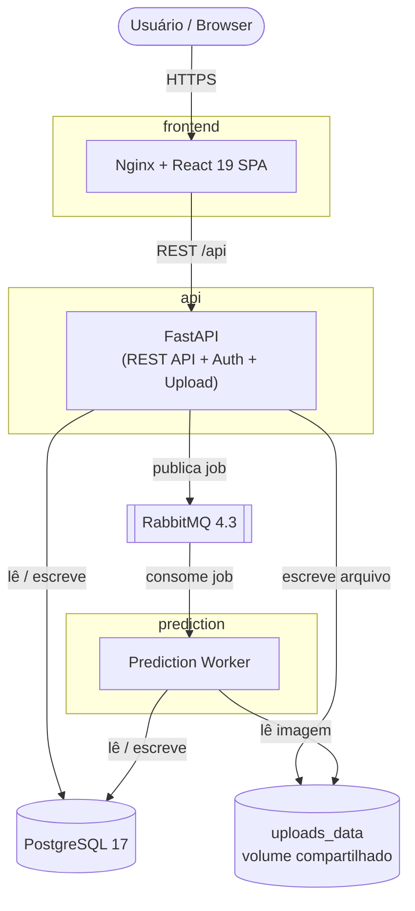

# ImplantDetect

**Título do TCC:** ImplantDetect: Sistema Web para Detecção de Implantes Dentários em Imagens Radiográficas Utilizando Modelos de Aprendizado de Máquina <br>
**Alunos:** Raphael Kenji da Rosa, José Antônio de Souza Ferreira <br>
**Semestre de Defesa:** 2026.1

[PDF do TCC](ImplantDetect__Sistema_Web_para_Detec%C3%A7%C3%A3oo_de_Implantes_Dent%C3%A1rios_em_Imagens_Radiogr%C3%A1ficas_Utilizando_Modelos_de_Aprendizado_de_M%C3%A1quina.pdf)


# TL;DR

Sistema web que identifica automaticamente implantes dentários em radiografias usando um modelo YOLO. Todo o ambiente (banco de dados, fila de mensagens, API, worker de predição e frontend) sobe com Docker Compose.

Para rodar:
```
$ cp .env.example .env   # preencha as variáveis obrigatórias
$ docker compose up --build
```
Frontend disponível em `http://localhost` e a API em `http://localhost:8000`.


# Descrição Geral

O ImplantDetect é um projeto voltado para a área de odontologia, com foco na identificação automática de implantes dentários a partir de imagens de raio-X.

Atualmente, muitos pacientes chegam aos consultórios odontológicos para realizar manutenções ou reparos em seus implantes sem possuírem documentos sobre a marca ou o tipo do implante utilizado. Como existem dezenas de marcas diferentes — cada uma com especificações, componentes e instrumentos próprios — o uso incorreto de componentes pode causar falhas ou até a perda do implante.

O projeto propõe uma solução baseada em aprendizado de máquina para analisar radiografias de forma automática, sugerir a marca e o tipo de implante identificado e, assim, aumentar a precisão do diagnóstico e reduzir o risco de erros clínicos. O trabalho conta com o apoio da Universidade Federal Fluminense (UFF), responsável pelo fornecimento do catálogo de implantes, do banco de imagens radiográficas e das classificações associadas a cada imagem.


# Funcionalidades

* Detecção automática de implantes em radiografias
   * Upload de imagens de raio-X pela interface web
   * Inferência com modelo YOLO em processamento assíncrono
   * Retorno da marca/tipo de implante identificado
* Gerenciamento de dados clínicos
   * Cadastro e consulta de imagens e classificações
   * Gerenciamento de rótulos (labels) via API
* Arquitetura orientada a mensagens
   * API publica jobs de predição em uma fila (RabbitMQ)
   * Worker de predição consome a fila e persiste os resultados
* Treinamento de modelos
   * Módulo dedicado ao treinamento e avaliação dos modelos YOLO


# Arquitetura

O sistema é composto por serviços independentes orquestrados via Docker Compose. O frontend consome a API, que persiste dados no PostgreSQL e enfileira predições no RabbitMQ. O worker de predição consome a fila, executa a inferência com o modelo YOLO e grava os resultados de volta no banco.



# Dependências

* [Docker](https://www.docker.com) e Docker Compose
* [PostgreSQL](https://www.postgresql.org) (imagem `postgres:17-alpine`)
* [RabbitMQ](https://www.rabbitmq.com) (imagem `rabbitmq:4.3.0-management`)
* [FastAPI](https://fastapi.tiangolo.com) — API do backend (Python)
* [Ultralytics YOLO](https://docs.ultralytics.com) — modelo de detecção
* [React](https://react.dev) + [Vite](https://vite.dev) — frontend
* [Node.js](https://nodejs.org) — build do frontend


# Execução

O projeto está dividido nos seguintes módulos:

* `implantdetect-backend` — API FastAPI
* `implantdetect-prediction` — worker de inferência (YOLO)
* `implantdetect-frontend` — interface web (React + Vite)
* `implantdetect-training` — treinamento e avaliação dos modelos
* `implantdetect-shared` — código compartilhado entre backend e worker

## Execução completa (recomendado)

Todos os componentes sobem com Docker Compose. Primeiro, configure as variáveis de ambiente obrigatórias:

```
$ cp .env.example .env   # edite .env com POSTGRES_PASSWORD, RABBITMQ_PASSWORD, DATABASE_URL, RABBITMQ_URL, SECRET_KEY
```

Em seguida, suba os serviços:

```
$ docker compose up --build
```

Serviços expostos:

* Frontend: `http://localhost`
* API: `http://localhost:8000`
* Painel do RabbitMQ: `http://localhost:15672`

## Execução em desenvolvimento (frontend)

```
$ cd implantdetect-frontend
$ npm install
$ npm run dev
```
